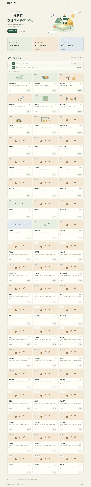

# MathPhysics · 科学小岛

面向小学一年级至六年级的 HTML 互动内容整合。三个主题：**几何工坊、动力车间、箭头港口**。

**首版只整合，不重写上游题目和游戏机制。完整内容收录与首页开放状态分开管理。**



## 内容范围

四个完整中文 PhET 模拟（Area Builder、Forces and Motion: Basics、Energy Skate Park: Basics、Vector Addition），完整 Tangram，以及 Matter.js 0.20.0 的全部注册示例与依赖。精确清单、数量与文件 SHA256 由导入脚本生成，见 [整合报告](docs/import-report.md) 和 [活动清单](config/inventory.json)。

Area Builder 保留所有6个难度等级与随机出题逻辑；其他 PhET 项目是多页面实验，不冒充固定关卡。Matter 的48个条目是物理/开发示例，不冒充48个教学关卡。Tangram 仓库只有1个内置快照，上游“更多图形”服务未完成。本版完整保留实际存在的内容，不虚构题目数量。

无明确许可证的 linear-transform-visualizer 未复制。Phaser、JSXGraph 是候选开发框架，不是已选择的课程库，本版不引入。

## 运行

已经完成资产导入的仓库或离线包，无需 npm、CDN、账号或后端数据库：

```bash
python scripts/serve.py --open
```

打开 http://127.0.0.1:8000 。Windows 安装 Python 3 后可运行 `START_WINDOWS.bat`。不能直接双击 index.html：浏览器 file:// 模式不能可靠加载模块、JSON 和本地 SVG。

局域网平板访问：

```bash
python scripts/serve.py --host 0.0.0.0 --port 8000
```

随后在同一网络访问电脑的局域网 IP:8000；需自行配置操作系统防火墙。仅在可信局域网使用此开发服务器，公网应使用正式静态服务器。GitHub Pages/Nginx 可直接托管仓库根目录；相对路径支持 `/MathPhysics/` 子路径。

`vendor/` 是实际本地内容，不是运行时跳转远程网站的链接。首次导入需要网络；已经随包提供资源后，课堂运行不依赖外部网络。原第三方程序可能尝试统计/帮助网络请求；测试会阻断外部请求，确认核心活动仍能启动。本项目不上传学生姓名或学习记录。

## 首批开放与后续启用

默认开放围栏花园、搬运挑战、箭头导航三项。其他已整合内容仍显示在内容库中，可在“老师 / 家长”工作台逐项开放、全部开放或临时预览。配置支持导入导出，本地探索记录不会因开放配置导入而清除。

全局默认值在 `config/defaults.json` 的 `openIds` 中修改。既有浏览器的本地设置优先；修改默认文件不会暗中覆盖用户已保存设置，可通过“恢复首批开放”应用新默认值。

**本版开放控制粒度为活动/模块。**进入 PhET 后仍保留完整原版导航，不对内部某一级强制锁定。年级是推荐筛选，不是权限系统。已探索表示成功启动过活动，不是通关、成绩或知识掌握；不将 iframe 打开事件伪装成完成关卡。

## 完整导入与测试

```bash
python scripts/import_upstream.py
npm install --ignore-scripts
npm test
npx playwright install chromium
npm run test:browser
python scripts/package.py
```

首次导入解析并固定上游提交，保存完整源码与原始压缩包、官方中文模拟 HTML、依赖和全部内容清单。之后按锁文件校验字节，不自动跟随 latest 覆盖资源；哈希不符时停止。更新上游需显式评审锁文件，不能删除题目后仍宣称完整。

GitHub Actions 会执行导入、静态与浏览器测试；通过后提交 vendor 和生成清单，并提供 `MathPhysics-offline` 下载包。实际测试结果见 [测试报告](docs/test-report.json)。查看 Actions 的最终状态，不以 README 代替实际测试结论。

## 目录

```text
index.html                 统一科学小岛入口
src/app.js                 活动目录、筛选、加载与设置
src/state.js               本地状态验证与持久化
src/adapters/matter.html    独立原版示例加载页面
src/matter-runner.js        Matter依赖映射与生命周期
config/defaults.json       默认开放内容
config/inventory.json      全量活动与文件哈希（生成）
config/upstream-lock.json  上游提交与原始下载哈希（生成）
vendor/                    完整本地上游内容，分别保留原许可证
scripts/                   导入、静态服务、打包
tests/                     目录完整性、状态与浏览器启动测试
docs/                      报告、维护说明与截图
```

## 范围与限制

保留原版界面，所以当前各活动的视觉风格尚未统一成单一游戏。尚无统一积分、自动通关判定、章节内逐题锁定、跨设备同步、个人账号或全课程教学验证；这些不属于第一版“只整合”的范围。

仓库保留完整资源，但不会同时启动全部模拟。进入活动时才创建一个 iframe，退出即销毁，避免后台物理循环占用平板资源。压力测试完整收录但默认关闭。

Chromium 自动化/触屏模拟不等同于实机 iPad Safari 验收；任意随机题目的教育准确性不由启动测试保证。建议课堂使用前对实际设备与课件选题进行检查。

## 授权

新增宿主代码为 MIT，不对第三方资源重新授权。PhET 官方 HTML 成品按当前 **CC BY-NC 4.0，非商业用途**处理；源码主要 GPL。Tangram 为 GPL-3.0；Matter.js 代码 MIT；其他依赖和素材遵循原声明。详见 [THIRD_PARTY_NOTICES.md](THIRD_PARTY_NOTICES.md)。任何收费、广告支持或商业分发需先重新核对授权。
