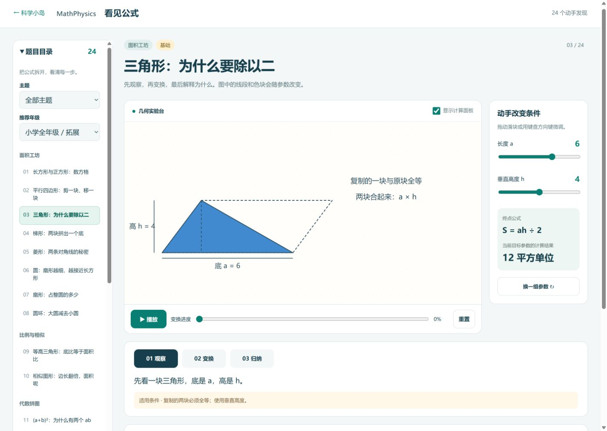
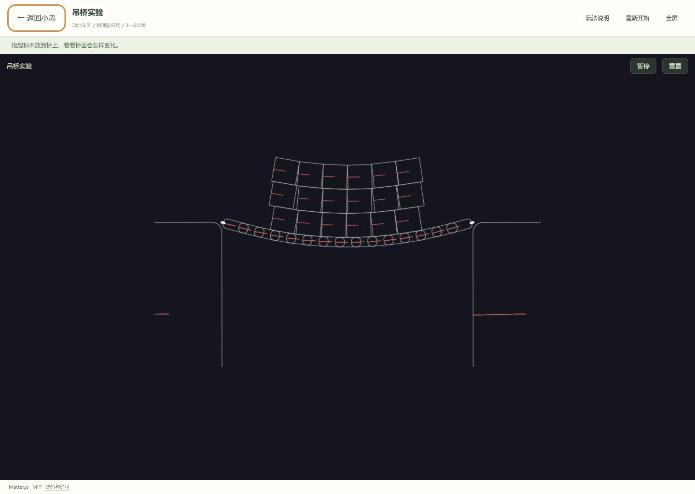
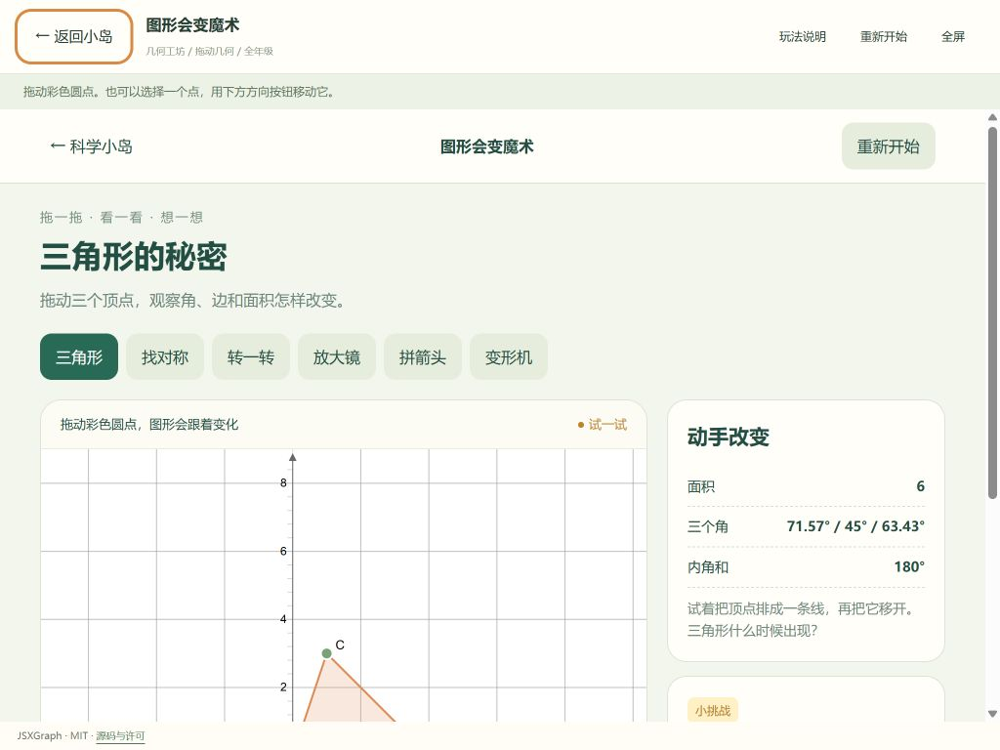

# 科学小岛：非 PhET 模块视觉重构提案

状态：**现状审查与方向选择，尚未实施 UI 改动。** 记录日期：2026-09-30。

面向小学一至六年级，以电脑与 iPad 横屏为主。目标是让孩子首先看见可操作的实验对象，并通过清晰的状态、短提示和图形变化理解原理。视觉风格现代、活泼、圆润，避免幼儿化。方向确认后在独立分支实施；正式视觉验收使用 **sol / high**。

## 真实基线与范围

检查对象是本机 `MathPhysics` 当前工作目录，Git 分支 `main`，HEAD 为 `a66c04e`。目录已有大量未提交修改，包括现有 PhET 视觉改编。本提案以**当前工作文件**为基线，不以旧提交覆盖它们。此次仅增加本目录内的审查资料，没有修改产品代码、创建实施分支或覆盖设置。

清单共有 **57 个活动入口，53 个属于此次内部 UI 重构范围**：48 个 Matter.js 实验、1 个三维七巧板、4 个本地课堂入口。4 个 PhET 活动的内部界面、人物、素材和计算保持原样。默认开放 22 项只作为现状记录，不是重新设置用户配置的指令。

| 模块 | 必须完整保留的内容 |
| --- | --- |
| 首页、主题与目录 | 全部 57 个入口、活动 ID、主题与年级筛选、搜索、开放状态、访问记录 |
| 老师／家长工作台 | 每项开放控制、临时预览、推荐与全部开放／暂缓、恢复推荐、配置导入导出 |
| 公共播放器 | 返回、玩法说明、重置、全屏、加载与错误反馈、原有来源及许可 |
| Matter.js | 全部 48 个示例及其物体、约束、参数、鼠标交互、运行与重置行为 |
| JSXGraph | 三角形、对称、旋转、缩放、向量、线性变换 6 项及全部参数、方向按钮、小挑战 |
| 平面七巧板 | 7 块拼板、2 个现有目标、旋转、提示、单块帮助、吸附与完成判定 |
| 三维七巧板 | 现有目标、拼块形状、相机与操作方式、快照／链接格式、原拼合判定 |
| 几何证明 | 24 题：面积 8、比例 2、代数 5、立体 9；全部步骤、参数、练习、答案与前提 |
| 航天课堂 | 4 条路线、62 个任务节点、8 个原理实验、7 套结构图，以及分年级解释与学习记录 |

[baseline.json](baseline.json) 记录了 57 个入口契约、169 个保护文件的 SHA-256、16 个可调整表面文件的基线和既有工作区状态。哈希用于比对，不是文件备份。活动计数依据配置与代码；以下截图是当前版本实际运行的代表画面，并不代表已完成全部活动的功能回归。

## 截图中最需要解决的问题

| 优先级 | 证据 | 对操作的影响 | 视觉调整方向 |
| --- | --- | --- | --- |
| 高 | [04 公共播放器](before/04-jsxgraph-player-desktop.png)、[05 横屏](before/05-jsxgraph-player-tablet.png) | 宿主和子页面重复标题；较矮横屏中，图形与操作栏不能同时看到 | 宿主模式采用一层导航；压缩介绍，实验画布与常用操作留在首屏 |
| 高 | [10 吊桥](before/10-matter-bridge-player.png)、[11 弹弓](before/11-matter-slingshot-player.png) | 黑底细线框、角度调试线和空白区域削弱物体、绳索和运动的辨识 | 基于原刚体和约束绘制实色物体、接缝与绳索，强化可抓取状态与真实运动反馈 |
| 高 | [08 三维初始](before/08-tangram-3d-desktop.png)、[09 拼装](before/09-tangram-3d-play.png) | 大面积同色目标，角落只有小图标，开始和观察动作不直观 | 用文字加图标显式标注操作；拼块加编号、边缘和选中轮廓，目标轮廓与活动拼块分层 |
| 高 | [14 航天任务](before/14-spaceflight-journey.png)、[16 对接](before/16-spaceflight-docking-lab.png) | 任务与栏目导航占据顶部，关键场景和对接控制被挤向下方 | 任务阶段压成紧凑进度带；飞行器居中，推进控制与速度／距离／姿态读数相邻 |
| 中 | [18 线性变换](before/18-jsxgraph-linear.png)、[19 横屏](before/19-jsxgraph-linear-tablet.png) | 拖点、标记、线条相对网格过小；参数与图形关系不够直接 | 放大点的可操作区域，使用编号、字母和双层轮廓，减弱网格；相同符号贯穿图形与参数 |
| 中 | [12 几何证明](before/12-proof-triangle.png)、[13 变换中](before/13-proof-triangle-transform.png) | 左目录、右参数和上下说明分散注意力，实际图形偏小；步骤操作会改变滚动位置 | 目录收起但入口常驻，扩大图形；步骤、播放进度和短解释聚合，公式靠近对应图形 |
| 中 | [06 平面七巧板](before/06-tangram-flat-desktop.png)、[07 吸附](before/07-tangram-flat-snapped.png) | 目标、拼块、控制区需要更鲜明的层级，旋转与吸附状态值得突出 | 每块保留编号，选中轮廓更明显；旋转按钮带方向和角度，吸附成功给短动画与文字 |
| 中 | [01 首页](before/01-home-desktop.png)、[02 目录](before/02-library-desktop.png)、[03 工作台](before/03-teacher-desktop.png) | 首页介绍占据大部分首屏，目录图示不足以区分实际活动，管理列表偏密 | 缩短欢迎区，展示真实实验对象缩略图；主题、筛选、状态统一；工作台按主题组织现有控制 |

### 同题现状：三角形为什么除以二

### 实验内部现状：吊桥

### 平板横屏现状：公共播放器中的图形实验

## 三个待选方向

三张概念图采用同一题、相同参数（底 a=6、垂直高 h=4、三角形面积 12 平方单位），以便比较布局和视觉系统。它们是设计效果图，不是已运行的新页面。对图形的精确坐标、比例、公式、中文与状态一致性，实施时以原数学代码和教学内容为准。图片不会替代可交互的 SVG、Canvas 或 Three.js 场景。

| 方向 | 画面和操作安排 | 适用考虑 |
| --- | --- | --- |
| 清爽探索台 | 米白底、深青文字、蓝与杏橙实体图形；大画布加右侧窄控制区，步骤与播放靠近画面 | 图形、公式、参数同时清晰，适合多个课堂模块共享 |
| 开放拼图桌 | 连续的大画板，控制集中在底部；奶油色、陶土色、明亮蓝，轮廓清楚 | 操作对象最突出，适合剪拼、七巧板和拖动实验 |
| 科学观测站 | 紧凑左侧操作区，大幅右侧场景；深蓝、青色与琥珀点缀，分隔清楚 | 强调任务过程与读数，适合航天、向量与高年级探索，同时保持低年级可点击性 |

概念图已在聊天中分别显示。**按实际显示顺序绑定**：[选项 1](concepts/01-clear-discovery.png)、[选项 2](concepts/02-open-shape-table.png)、[选项 3](concepts/03-observation-station.png)。[concepts.json](concepts.json) 保存了这组对应关系；当前尚未选择方向。用户确认后才创建实施分支。

效果图仍有需在实施中校正的细节：选项 1 的播放滑块位置没有对应标注的 100%；选项 3 的拼接对角线和尺寸线端点需要按原几何坐标重画。各图中的滑块端点示例不替代原参数范围，引导角色落地时控制在约 48–64 CSS px。选择方向表示选择布局和视觉风格，不表示接受这些示意误差。

## 跨模块的共同设计规则

- **对象优先。** 电脑与横屏平板中，实验场景争取占主要内容面积约三分之二；压缩重复标题和说明，而非缩小操作对象。目录可收起，但入口常驻。小屏允许内容顺序向下排列，不靠整体缩放压成微小控件。
- **一套控件。** 返回位置、主操作、重置、帮助与选中样式一致。常用触点目标至少 48×48 CSS px；滑块有清晰滑轨、较大拇指和即时数值。连续参数保留原范围、步长与键盘操作。
- **状态有多种线索。** 选中同时使用轮廓、符号与文字；拼块带编号，拖点带字母；成功有勾选与说明，错误说明可调整的条件，不只把对象涂红。功能不依赖悬停才能发现。
- **角色节制。** 重新设计小型岛屿引导机器人，面部简单、比例利落，用手势或指向标记提示关键动作。课堂内不常驻大人物或长气泡，不给科学物体加影响结构辨识的表情。PhET 的人物和素材不触碰。
- **图形准确。** 数学多边形的顶点和直边不因圆润风格变形；物理装饰遵循刚体真实位置与转角；飞行器的舱段和结构特征保持可辨。圆角主要用于控件和非精确装饰。
- **教学信息分层。** 默认短句说明“做什么、看哪里”；公式、模型前提、练习与深入解释仍可直接展开。保留现有年级分层，不新增影响记录的账号、等级、积分或通关系统。
- **动效解释变化。** 吸附、选中、剪拼衔接可用短动效；装饰动效克制并尊重减少动态偏好。物理、几何和航天的计算时间线不能为了观感修改。

## 深入内部画面的实施映射

| 表面 | 具体调整 | 保持不变 |
| --- | --- | --- |
| 首页／目录／导航 | 精简欢迎区；真实对象缩略图；清晰主题、年级和开放／已探索标识；统一图标 | 57 个活动、活动 ID、入口、原筛选含义、访问记录 |
| 老师／家长工作台 | 主题分组、较大开关、清楚的已开放状态和导入反馈；管理操作与儿童操作区分 | 所有现有管理动作和配置格式；不自行恢复默认值、不覆盖自定义列表或故意留空的配置 |
| 公共播放器 | 单行导航、场景高度分配、紧凑教学提示、易点击的全屏／重置 | iframe 隔离、单实例销毁、路由、消息来源校验、加载与就绪判断，尤其是 PhET |
| Matter.js | 在原渲染数据上加展示层：实体填色、轮廓、桥面接缝、绳索层次、连杆端点、斜坡表面、拖动高亮；按球、刚体堆叠、车辆、绳链／软体、传感器等覆盖所有示例 | body 顶点、质量、摩擦、恢复系数、约束长度与刚度、引擎及更新时序；不能为“吊桥”另造有不同受力模型的桥 |
| JSXGraph | 扩大有效拖点区域，双层点环和字母；主线与辅助线分层；向量箭头、分量、矩阵对应关系清楚；方向按钮持续可见 | 原坐标、吸附步长、变换公式、全部参数范围、挑战容差；退化矩阵和原点等情况仍可探索 |
| 平面七巧板 | 7 块的颜色、编号与边线组成稳定身份；选中和已归位不同；旋转显示方向与 15°；吸附出现短确认，完成显示 7/7 与教学反馈 | 拼块坐标、目标、位置／角度容差、唯一占位、归位锁定、帮助计数和原有完成判定 |
| 三维七巧板 | 更新材质、光照、边线、拼块身份；开始／观察等原按钮增加明确标签；选中与操作提示进入统一控件体系 | Three.js 几何内核、厚度与碰撞／拼合规则、相机交互语义、快照和 t 参数兼容 |
| 几何证明 | 逐题调整 24 个 SVG 场景的图形大小、文字锚点、辅助线和剪拼层次；步骤当前态清楚；公式中的 a、h 等与图中标记对应 | 全部题目、观察／变换／归纳及其他原步骤、参数、时间线、练习和答案；不凭效果图添加原本不存在的顶点拖动功能 |
| 航天课堂 | 重绘火箭、飞船、空间站与阶段场景，结构颜色稳定；任务进度紧凑；原理实验中的方向、推力、速度、姿态和目标窗更清楚 | 4 路线／62 节点／8 实验／7 结构图；长二 F、长三甲、猎鹰 9、神舟、龙飞船、天宫与 ISS 的原教学区分；全部模型、参数、对接阈值和问答 |

### 文案处理

儿童界面删除或移出主操作区的对象包括面向开发者的版本介绍、库名宣传、整合说明和开发限制。不能机械删除所有带“模型”“不支持”或“示意”的句子：科学边界本身是教学内容。

保留“拖动彩色圆点”“选择拼块再旋转”“高必须垂直于底”等操作与原理提示；保留“教学示意而非真实飞行遥测”、理想模型前提、练习适用条件，以及来源和版权。库名与许可证可放在现有来源区域，但不删除署名。

## 实施边界与验证

确认方向后，以当前文件建立独立分支，例如 `design/science-island-non-phet`，先保存能区分既有修改与本次修改的基线。不得直接用干净 HEAD 替代当前目录，也不批量提交无关的已有修改。

1. 先完成共享设计规则与宿主布局，再接入各类实际渲染器；对独立打开和宿主 iframe 内打开都检查。
2. PhET 的 `vendor/phet/`、`src/phet/`、素材及专用构建逻辑保持逐字节不变。公共组件仅在外部布局上调整，验证 4 个活动加载至可操作画面、重置、全屏、返回与重新进入。
3. 保留 `mathphysics.state.v1` 和 `mathphysics.spaceflight.v1` 的键名、版本与数据语义。旧配置导入、学习记录、用户自定义开放集合、空集合和临时预览都纳入兼容检查，不清空存储。
4. 对 57 个入口做清单一致性检查；在代表实验中验证拖动、参数修改、暂停与重置；对所有内部场景做视觉覆盖。七巧板继续检验正确吸附、错误位置不通过、帮助与完成；几何和航天使用已有数学／内容测试加相应交互回归。
5. **sol / high 独立视觉验收**：拿用户选定效果图与实现截图比对，逐模块检查是否深入对象、控件和反馈；问题修复后再验收。不能只检查首页或以截图存在代替可用性。

建议验收尺寸：电脑 1440×1024 与 1366×768；平板横屏 1024×768 与 1180×820；小屏 390×844。验收必须覆盖触控目标、无悬停操作、键盘焦点、非颜色反馈、减少动态以及控件不遮挡对象。浏览器尺寸模拟与真实 iPad Safari 测试分别记录，不混称。

## 本轮检查的覆盖与限制

本轮已实际打开首页、目录、工作台、公共播放器、两个 Matter.js 场景、6 项图形实验所在模块的代表画面、平面与三维七巧板、几何证明、航天任务／对接实验／结构页。已观察平面拼板帮助后的 1/7 吸附状态和几何变换中间状态；已保存 PhET 宿主与内部起始画面作为保护基线。

截图通过 Codex 内置浏览器取得，主要采用 1440×1024 桌面窗口，并补充 1024×768 横屏和 390×844 小屏。内置浏览器的可用内容高度会扣除其工具栏；这些是尺寸模拟，未声称在真实 iPad 上验收。未逐一操作 48 个物理示例，未完成全部题目的回归，未运行改动后的测试，也尚未进行 sol 视觉验收，因为 UI 仍处于方向确认前。

### 完整截图索引

| 编号 | 截图 | 状态 |
| --- | --- | --- |
| 01 | [首页](before/01-home-desktop.png) | 顶部欢迎与主题 |
| 02 | [活动目录](before/02-library-desktop.png) | 筛选与活动条目 |
| 03 | [老师／家长工作台](before/03-teacher-desktop.png) | 管理对话框 |
| 04 | [图形实验／公共播放器](before/04-jsxgraph-player-desktop.png) | 桌面三角形 |
| 05 | [图形实验／公共播放器横屏](before/05-jsxgraph-player-tablet.png) | 1024×768 |
| 06 | [平面七巧板](before/06-tangram-flat-desktop.png) | 初始方形目标 |
| 07 | [平面七巧板吸附](before/07-tangram-flat-snapped.png) | 帮助放置后 1/7 |
| 08 | [三维七巧板初始](before/08-tangram-3d-desktop.png) | 目标展示 |
| 09 | [三维七巧板拼装](before/09-tangram-3d-play.png) | 开始后的拼块 |
| 10 | [Matter.js 吊桥](before/10-matter-bridge-player.png) | 宿主内运行 |
| 11 | [Matter.js 弹弓](before/11-matter-slingshot-player.png) | 宿主内运行 |
| 12 | [三角形证明](before/12-proof-triangle.png) | 观察阶段 |
| 13 | [三角形证明变换](before/13-proof-triangle-transform.png) | 变换进度 50% |
| 14 | [航天任务](before/14-spaceflight-journey.png) | 出发前检查 |
| 15 | [航天接近阶段](before/15-spaceflight-approach.png) | 飞船与空间站 |
| 16 | [航天对接实验](before/16-spaceflight-docking-lab.png) | 控制与读数 |
| 17 | [天宫结构](before/17-spaceflight-station.png) | T 字构型示意 |
| 18 | [线性变换](before/18-jsxgraph-linear.png) | 桌面 |
| 19 | [线性变换横屏](before/19-jsxgraph-linear-tablet.png) | 1024×768 |
| 20 | [图形实验小屏](before/20-jsxgraph-small.png) | 390×844 |
| 21 | [PhET 保护基线](before/21-phet-host-baseline.png) | 当前推拉小车起始画面，内部不改 |
