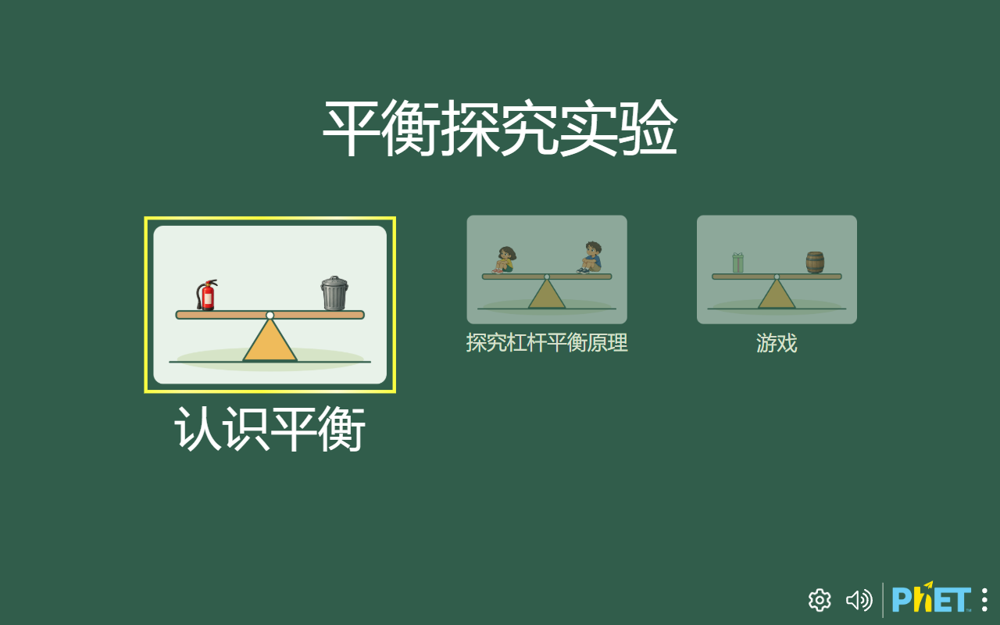
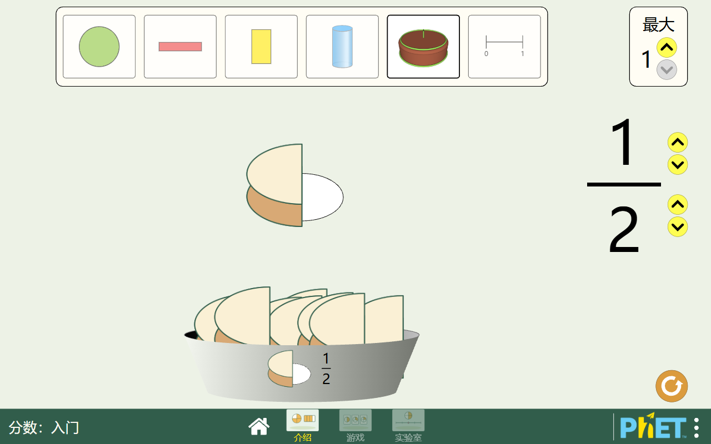
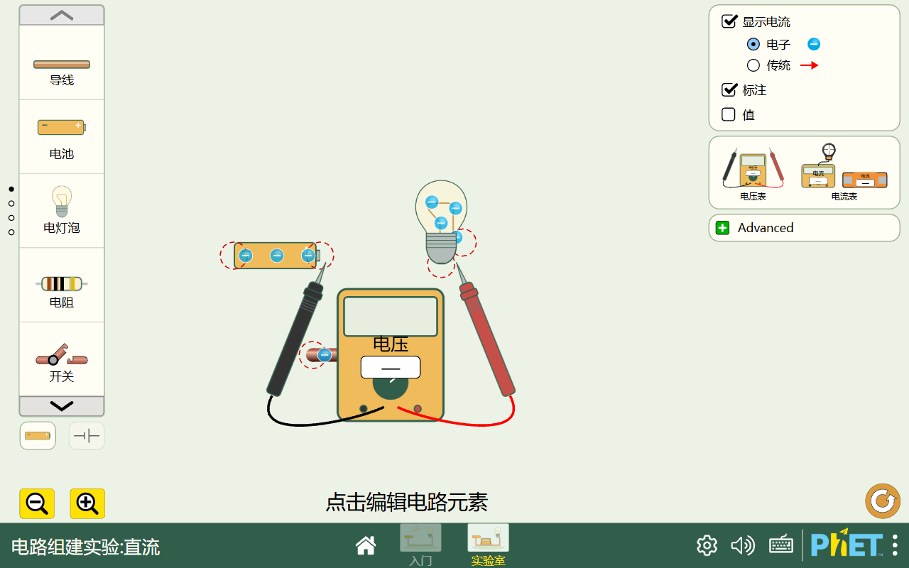

# 六个 PhET 扩展模块插画验收

日期：2026-10-01

## 结论

六个模块的选屏缩略图和 15 个实际屏幕均完成了桌面、平板和手机竖屏的实渲染检查。新插图与交互含义一致；未发现裁图串入邻格、图片遮挡关键控件或阻断操作的问题。六模块的菜单缩略图与底部导航都通过了真实鼠标命中检查。

手机竖屏下，PhET 横向画布缩放后控件和文字较小，但没有裁切或溢出；建议横屏使用。本轮为浏览器视口模拟，没有做真实设备触控测试。

## 检查方式与范围

使用本地 Chromium/Playwright 打开六份生成页，等待 `document.documentElement.dataset.expansionArt === 'ready'` 及各屏幕模型、视图初始化后截图。基线包括 18 张选屏菜单、45 张实际屏幕截图，以及六张 vendor 原版对照图；另为最终调整后的 `fractions-intro` 重拍了三个视口的菜单与游戏底栏。所有截图保存在 `output/playwright/phet-expansion/image-visual/`。

全量捕获记录为 6 个模块、15 个屏幕、0 个页面错误和 0 个本地资源加载失败。另有 54 个外部请求按本地验收配置拦截。完整计数见 `output/playwright/phet-expansion/image-visual/capture-metrics.json`、`menu-recapture-metrics.json` 与 `navigation-hit-metrics.json`。

## 图像与操作结果

| 模块 | 实测结果 | 证据 |
| --- | --- | --- |
| 分数入门 | 菜单顺序正确：介绍、游戏、实验室。介绍屏切换到 `CAKE` 后，`1/2` 显示为切去一半的蛋糕，`2/2` 显示完整且分片线清楚。实验室拖放两个 `1/2` 也能拼成整圆。 | `fractions-intro-menu-desktop-1280x800.png`、`fractions-intro-menu-mobile-390x844.png`、`fractions-intro-cake-1-of-2-desktop-1280x800.png`、`fractions-intro-cake-2-of-2-desktop-1280x800.png`、`interaction-fractions-two-halves-assembly-desktop-1280x800.png` |
| 分数配对 | 带分数菜单图明确显示一个整圆加半圆和 `1 1/2`；分数/形状的关卡图裁切完整。 | `fraction-matcher-menu-desktop-1280x800.png`、`fraction-matcher-menu-mobile-390x844.png` |
| 平衡实验 | 家庭插图在“探索杠杆平衡原理”缩略图中完整可辨。实际“认识平衡”屏拖动 5 kg 灭火器后，物体落在横杆支点左侧，质量标签没有压住控件。运行时 `massList` 的灭火器与垃圾桶 `imageProperty.value.src` 均为嵌有新 PNG 的 SVG 包装；vendor 原版对应项仍为渐变 SVG。 | `balancing-act-menu-desktop-1280x800.png`、`interaction-balancing-fire-extinguisher-on-beam-desktop-1280x800.png`、`balancing-act-vendor-screen-01-balance-basics-desktop-1280x800.png` |
| 直流电路 | 元件工具栏的电池 `−/+` 标记可辨，灯泡底脚和元件连接点清楚。拖入电池、灯泡、导线及伏特表后，黑色与红色探针及金属尖端可区分。这里只检查了元件与探针拖放，没有完成闭合回路通电实验。 | `interaction-circuit-components-before-wire-desktop-1280x800.png`、`interaction-circuit-voltmeter-dropped-desktop-1280x800.png` |
| 物质状态 | 固体、液体、气体按钮切换后，粒子从规整排列、底部聚集到容器内分散，颜色对比足够。相变屏的手指尖端落在活塞按压位置；热/冷文字与红/蓝滑块相互对应。 | `interaction-states-solid-desktop-1280x800.png`、`interaction-states-liquid-desktop-1280x800.png`、`interaction-states-gas-desktop-1280x800.png`、`states-of-matter-basics-02-phase-change-desktop-1280x800.png` |
| 分子搭建 | 氢、氧、碳、氮、氯元素在桶中标签清楚，氧为 `#ff5500`，与拖入工作区的氧原子一致。拖入氢后能贴近氧形成分子。单/多分子屏的黑色目标槽也存在于 vendor 原版，属于原设计。 | `build-a-molecule-menu-desktop-1280x800.png`、`interaction-molecule-oxygen-hydrogen-placed-desktop-1280x800.png`、`build-a-molecule-vendor-screen-02-desktop-1280x800.png` |

六模块的菜单缩略图和底部导航均用鼠标实际点击验证，切换到目标屏幕正确，0 页面错误。最终调整后的分数入门菜单再次确认“游戏”图对应关卡卡片、“实验室”图对应分数数轴；桌面第一击选中“游戏”、第二击进入，底栏点击“实验室”切屏成功。蛋糕表示及分子属性记录见 `cake-representation-metrics.json`；三视口重拍记录见 `fractions-intro-final-menu-nav-metrics.json`。

## 视口观察

1280×800 与 1024×768 下，菜单卡片、实际画布、右侧工具栏和底部导航均完整显示，未见横向溢出。390×844 下六模块内容仍完整，但小字、探针及底部导航目标较小，平衡与分数场景四周留白明显；这是竖屏视口中的画布缩放观感，不是图片裁切。建议手机横屏查看。

## 图片示例与收尾

[完整捕获记录](../../output/playwright/phet-expansion/image-visual/capture-metrics.json) · [实际点击记录](../../output/playwright/phet-expansion/image-visual/navigation-hit-metrics.json) · [蛋糕表示记录](../../output/playwright/phet-expansion/image-visual/cake-representation-metrics.json) · [素材生成提示词](../../src/phet/assets/expansion/prompts.md)

验收由 Luna / max 完成，保留112张正式截图与5份指标记录。测试浏览器和本地服务已关闭；主 Agent 再次绑定52347端口并释放成功，确认端口可复用。临时探测脚本与截图已清理。
