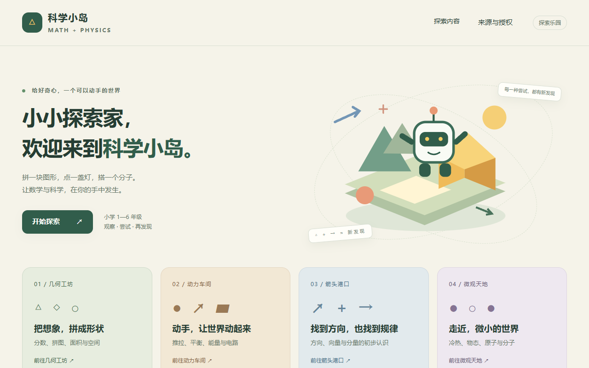
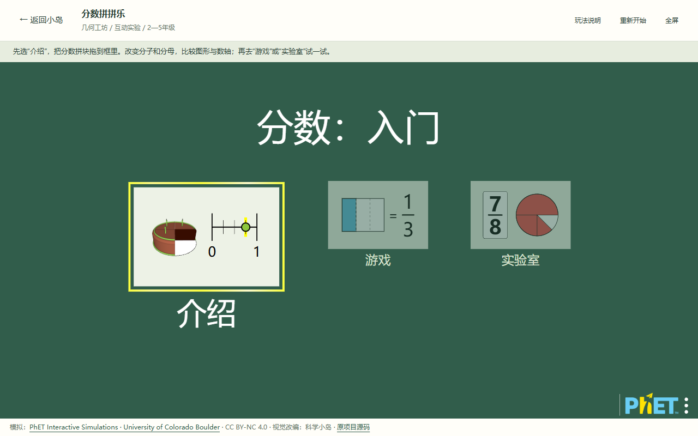
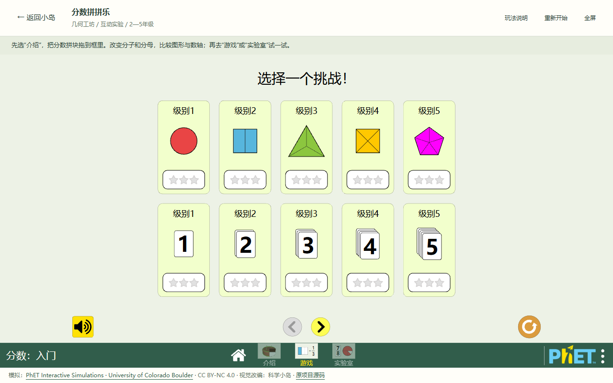
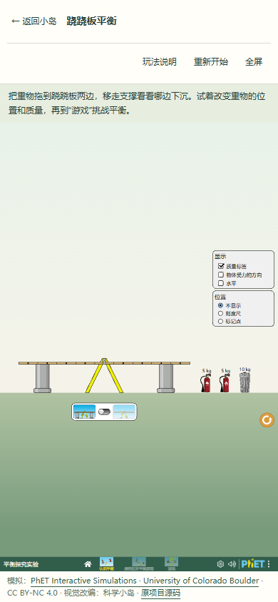
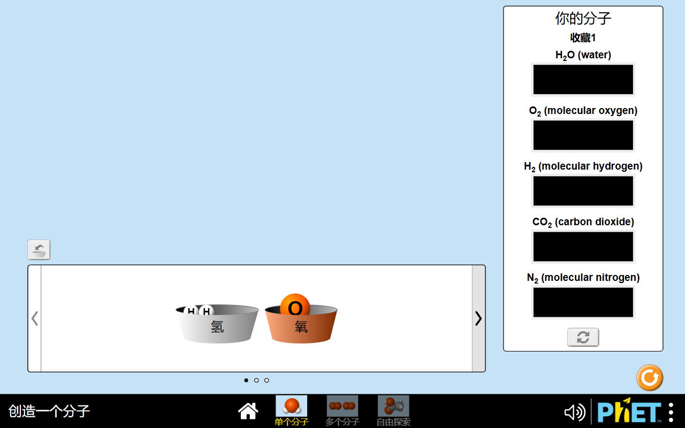

# 新增 6 个 PhET 模块视觉验收

**结论：通过。** 六个新模块的选择菜单、15 个实际实验屏和宿主提示均已在本地 Chromium 中按 1280×800、1024×768、390×844 检查。菜单文字对比度和分数游戏英文标题修正后，已复核六模块菜单与首屏；三个尺寸的“选择一个挑战！”标题也已复核。

## 首页与宿主

三尺寸均能看到六张新增 PhET 活动卡及独立 SVG 图示。首次全量截图时首页有 22 张活动卡；题库接入改动随后加入一项活动，最终复核看到 23 张。分类入口分别为桌面 4 列、平板 2 列、手机 1 列；活动卡网格为桌面 3 列、1024 宽 3 列、手机 1 列。页面无横向溢出，筛选行无横向滚动溢出。

“微观天地 + 五年级”筛选在三尺寸均只显示“冷热变变变”和“分子搭建工坊”；搜索“电路”均只命中“点亮小灯泡”。所有新增模块的宿主提示可见且完整，玩法说明开关正常，归属、年级和 PhET 授权信息布局可见。

## 选择菜单与实际实验屏

完整首轮验收覆盖 6 个选择菜单与 15 个实验屏，三个视口合计 18 张菜单图、45 张实验屏图。屏幕切换到对应的实际 PhET 屏幕后才截图，屏幕名称与预期一致；本地页无资源加载失败或浏览器页面错误。修正后又复核了 18 张菜单图、18 张首屏导航图及 3 张分数游戏图。所有屏幕画布都没有超出视口宽度。

未选屏幕标签现为浅叶绿，在森林绿背景上的对比度为 **5.60:1**；选中标签为白色，对比度为 **7.51:1**。分数游戏屏标题现为“选择一个挑战！”，三个视口均正确显示。`build-a-molecule` 的“单个分子/多个分子”目标栏黑色矩形与原版 `vendor/phet/build-a-molecule.html` 相同，属于上游原版画面，不是主题集成造成的回归。

竖屏手机下 PhET 画布缩放后仍完整显示，没有裁切或横向溢出；部分模拟内部的导航文字、分子清单和砝码标签显得较小，作为非阻断的移动端可读性观察保留。这里的手机尺寸来自 Chromium 视口模拟，未做真实设备触控验收；需要操作较小控件时可建议横屏使用。

本次汇总指标见 [visual-audit-metrics.json](../../output/playwright/phet-expansion/visual/visual-audit-metrics.json)。

首页示例：

菜单与实验屏示例：

原版目标槽对照：

截图目录：`output/playwright/phet-expansion/visual/`。测试期间使用的浏览器与本地服务均已关闭；各服务端口关闭后均成功重新绑定，确认释放。
